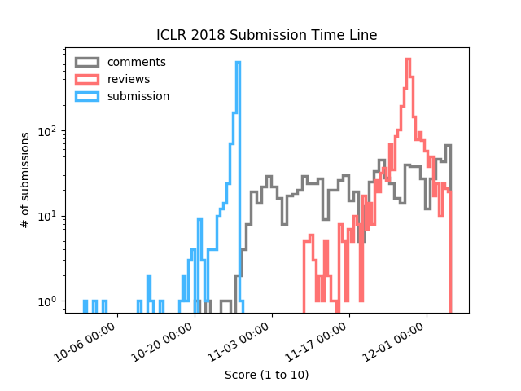

# ICLR_2018_analysis

I did some analysis on the submissions to this ICLR (2018). Looks like the average rating is just above 5.

| Stats      |      |
|:---------- |:---- |
| mean       | 5.23 |
| median     | 5.33 |
| our rating | 5.33 |

## How Tardy Are We?

It is also interesting to look at when people submit their paper and reviews. 

Looks like a lot of people start reviewing the paper submitted as soon as the review period started!

## Is it better to submit later?

- [ ] todo: look at the distribution w.r.t. submissions submitted at different time.
