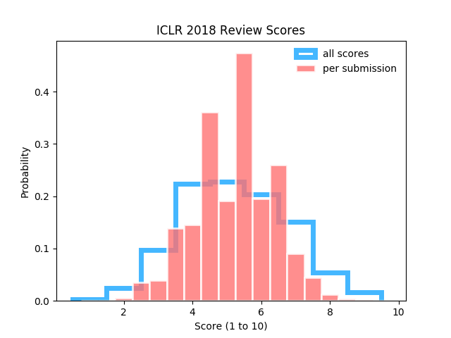

# ICLR_2018_analysis

I did some anlysis on the submissions to this ICLR (2018). Looks like the average rating is just above 5.

| Stats      |      |
|:---------- |:---- |
| mean       | 5.23 |
| median     | 5.33 |
| our rating | 5.33 |

